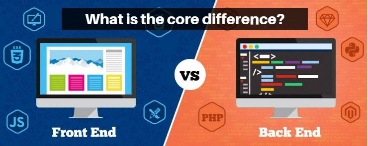

# Intro to Web Development & Basic Concepts


1. What is Web Development?
2. Is it still worth learning in 2021?
3. What fields can I work in?
    - Front end 
    - Back end - Monolith vs Microservices, APIs, System Design
    - DevOps
    - QA/Testing
4. How does the web work (an overview)
    - What happens when you type lsacbucuresti.ro in your browser
    - Request/Response
    - Async
    - Public domains and DNS
    - Web servers and how to configure them (deploying)
        - Virtual hosts
        - Custom ports

## 1. What is Web Development

If we are thinking in broad terms, web development refers to the **building and maintenance of websites**. But there is a common misconception, and you might hear this from people who did 1 HTML course and consider themselves experts:

<p style="color:red"> I hate web development because it's so simple, you just need to put some elements on the page in the right order. It's not technically challenging, HTML is not a programming language.</p>

While it is in some portion true, HTML is just the base of the pyramid, and it's only **front-end**. A web application can be as complex or more complex than any mobile/native application, especially since the **back-end** is usually shared between all versions of an app.

A real web developer understands and respects the process and all the sub-fields associated, regardless of technology. It is also worth noting that building web applications for 100 users is way more different and difficult than building web applications for 10000 users :)

## 2. Is it still worth learning in 2021?


Yes, yes, yes and ... 1000 times YES! Web Development is one of the fastest growing areas and there will always be a need for it. Why? Because accessing a website is the fastest, most convenient way of getting information.

Also, many of the concepts that apply to web development apply in other fields as well. For example, if you know **JavaScript**, which is fundamentally a web programming language, you can use

- **ReactJS** for your web interface
- **React Native** for your mobile interface
- **ElectronJS** for your desktop interface

... all in one programming language!

Now, if you are interested in some fields like Machine Learning, for example, you might be wondering: **how does this help me**? It won't help you when building the models themselves, but it will help you in deploying such a model, as you will probably need to create an API to interact with it (back-end development).

## 3. What fields can I work in?



Web development is a very vast domain, with plenty of opportunities. Below are the most popular ones:

- **Front end**: Handles the visual side of applications, building user interfaces. Front-end developers usually focus on developing interfaces as modular as possible, which are fast, responsive and reliable. The most popular programming language here is **JavaScript**, combined with **HTML** and **CSS**.
- **Back end**: Handles the "functionality" of applications. A back-end developer usually needs to focus on very efficient systems and algorithms, interact with databases, servers, distributed algorithms and system design.
    - **APIs**: Application Programming Interface. This is usually the way back end developers work. They expose the code through "endpoints", which can later be used from any other place with ease and in a similar manner. Example: you have an online shop with a web and mobile interface. As a back-end developer you have been tasked to provide a product feed to both interfaces. The easiest way to do this, both for you and for the front-end team, is to create an endpoint like ```myawesomeapp.lsacbucuresti.ro/products``` and then tell the front end team to consume that endpoint. **Q: Why is this better?**

    - **System Design** - Sub-field which focuses on designing high level architectures and systems for large scale applications. These systems need to be VERY reliable and usually handle a lot of requests.
    - **Programming languages**: back-end can be done in MANY languages and it really is up to the developer and the team, the most popular are: **Java, JavaScript, PHP, Python, C#, Ruby** but there are many other options.
-  **DevOps**: Builds tools, environments and pipelines to automate deployment/integration processes (Continuous Integration & Continuous Deployment : CI/CD).
    - Docker, Jenkins, Kubernetes, Terraform
- **QA (Quality Assurance)/Testing**: Builds automated testing pipelines and ensures that code is at the highest quality and functional.

- **Other fields which we won't cover**: Security, Infrastructure, System Administration

## 4. How does the web work

This section is going to be mostly practical, so please refer to the stream :) Below are the most important terms:

- **Request/Response** - The most basic paradigm on top of which the web functions. Say client types ```google.com``` in his browser, this will send a request to the Google servers. The Google servers will return a response with the content of the page.

- **Async** - Compared to normal requests, async requests are non-blocking. That means even if they receive the response with delay, it won't interrupt the flow of the application, and instead will load the result asyncronously, when the response has arrived.

- **Public domains** - easy to remember aliases for IPs. Examples: ```google.com```, ```lsacbucuresti.ro```, ```facebook.com```.

- **DNS (Domain Name System)** - Hierarchical, decentralized system which links public domains to IPs.

- **Web Servers** - Servers which handle HTTP requests (client requests). Usually run on port 80 for **HTTP**, and port 443 for **HTTPS**.