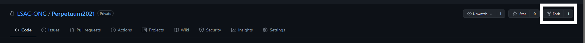
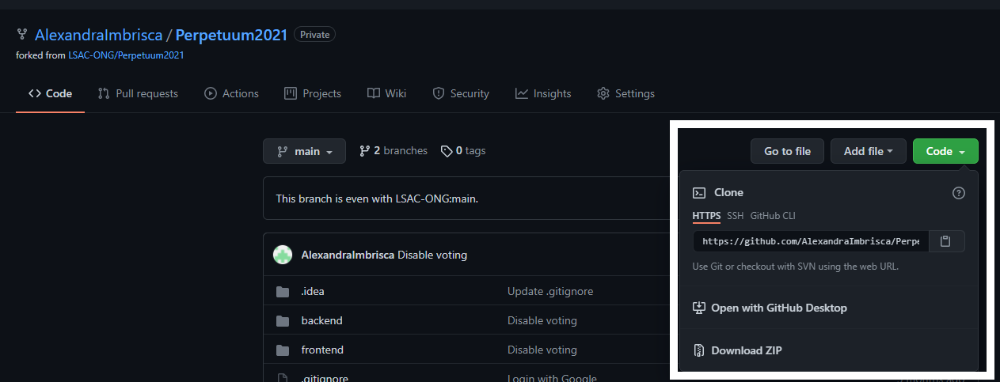
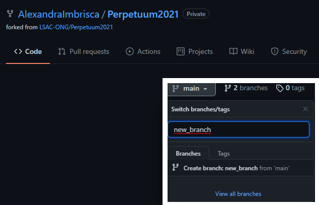
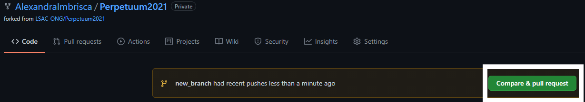
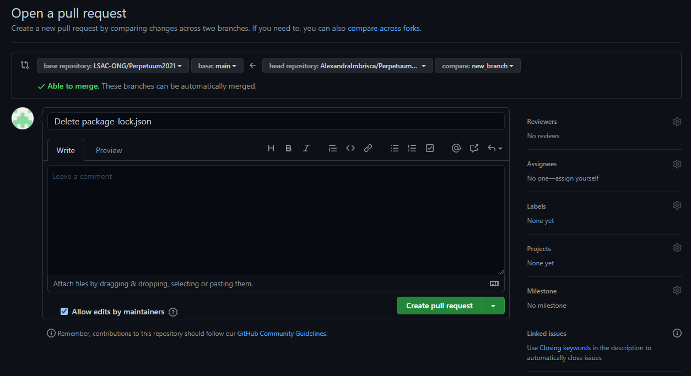

# Contribute to a repository

## Fork the repository


## Clone the new fork locally


## Track the original repository
Changes to the original repository are not pushed directly to the fork. We can fetch the original repository by linking it to ***upstream***:
```
git remote add --track master upstream git@github.com:LSAC-ONG/Perpetuum2021
git fetch upstream
```

## Create a new branch


## Change things
[Do something]

## Push the changes
Add the changes, create a commit and push it.

## Create the pull request


