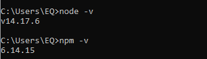
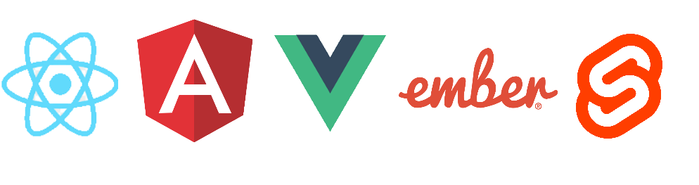
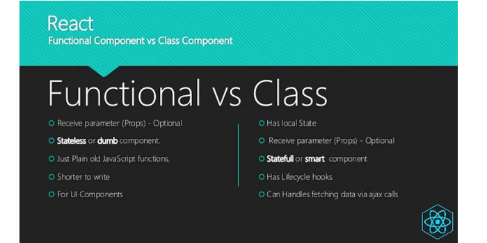

# React Workshop
> Workshop made with ❤️ by [Stefan Popa](https://github.com/stefanp0pa)
## Workshop Plan
- Introduction about React
- Declarative and imperative paradigms
- Components and components hierarchy
- State and lifecycle
- Props and data-binding
- React Hooks
- **Bonus**: Tailwind CSS

## Prerequisites

* Download and install [Node and npm](https://nodejs.org/en/download/) (Node >= 14.0.0, npm >= 5.6.0)
* Download and install [Visual Studio Code](https://code.visualstudio.com/)
  - add the following [extensions](https://dev.to/rohidhub/top-10-vscode-extensions-for-react-57g6) (recommended)
  - set up [Github Copilot](https://copilot.github.com/) (not mandatory, but has intelligent code completion)
* Download and install [Git](https://git-scm.com/downloads) and any other Git-client (e.g. [GitKraken](https://www.gitkraken.com/))

Check for succesful installation by running the following commands in the terminal: `node -v` and `npm -v`

Try to set up a React project by running the following commands in the terminal:
* `npm install -g create-react-app` (install the React utility globally)
* `npx create-react-app my-react-app` (create a new React project)
* `cd my-react-app` (create a new directory)
* `npm start` (start the React app - by default on port 3000)
* navigate to the `localhost:3000` in your browser 
  

Basic React setup could be followed [here](https://www.codecademy.com/article/how-to-create-a-react-app). This reference explains the steps in detail and gives further explication about a project structure. In order to install any available package, check the [NPM official page](https://www.npmjs.com/) for that package.

## What is React?

[React.js](https://reactjs.org/) is one of the most popular (maybe the most popular) solutions for building Web applications, which follows a declarative paradigm based on creating reusable components. React is a common solution among other frameworks such as [Angular](https://angular.io/), [Vue.js](https://vuejs.org/), and [Ember.js](https://emberjs.com/) and is rather popular among developers who are familiar with the JavaScript language.

Frameworks such as **Angular** or **Vue.js** are in general better suited for complex and intensive production projects due to their rigorous structure and modularity, whereas **React** would be a better pick for simpler applications. Nevertheless, there are definitely popular projects that have employed React as a [solution](https://hashnode.com/post/what-are-some-popular-websites-that-use-reactjs-ciibz8fb8016nj3xto8stgu4e) (e.g. Facebook, Instagram, New York Times, etc.).

### Features

React is/has:
- **component-oriented**: the application is built from components, which are the building blocks of the application.
- **declarative**: in React you declare how the UI should look like, without worrying about the implementation details.
- **simple**: you can set up and run a React app in a few minutes.
- **easy-to-learn**: smooth learning curve in comparison with other frameworks, such as Angular
- **data-binding**: React uses one-way data-binding to update the UI based on the state of the application
- **Virtual DOM**: a special in-memory data structure that is used to efficiently update the UI ([more info](https://www.codecademy.com/article/react-virtual-dom))
- **performant**: React is designed to be performant because uses this underlying Virtual DOM

### Declarative and imperative paradigms

These two paradigms could be described as [follows](https://stackoverflow.com/questions/1784664/what-is-the-difference-between-declarative-and-imperative-paradigm-in-programmin):
- **Imperative**: you tell the compiler what you want to happen, step by step
- **Declarative**: you write code that describes what you want, but not necessarily how to get it

The following syntaxes reflect the two paradigms:
- Imperative
  * `a.setColor(red)`
  * `a.setCount(180)`
  * `a.addCount(20)`

- Declarative
  * `return View(color: Red, count: 180)`

What does this mean for React? It means that views are in general **immutable**, only **state mutates**. The state describes how components are drawn and which components are visible or not. Every state mutates *triggers* the re-rendering of the UI and the browser "redraws" the view according to the new state.

- **Imperative**: you are the chef and you cook by the recipe
- **Declarative**: you write the recipe and the compiler will "cook" it

### Components

React allows for creating reusable components that are organized in a parent-child type hierarchy. Components communicate mostly via **props** which are, basically, parameters that are passed from the parent component to its children.

`<CarComponent color={this.color} name={this.color == "red" ? "Ferrari" : "Lamborghini" }/>`

Traditionally, components are of two types: class-based and functional. Class components are generally used because they can have an internal state, while functional components are stateless and shorter to write. Following the React Hooks update, functional components can manage state as well and have become the default standard for modern React development.

### React lifecycle

The React component lifecycle has the following 3 phases:
- **mounting**: the state when an element is put into the DOM
- **update**:	the state when an element is updated in the DOM
- **unmounting**: the state when an element is removed from the DOM

**Mounting** is triggered only once, same with **unmounting**. **Update** is triggered every time the internal state mutates, which is followed by the re-rendering of the component on the screen.

### React Hooks

**React Hooks** is a new addition in React 16.8 and let you manage state and other React features without writing a class. React Hooks have become the default modern standard of writing React components, though classes are still an available option. These hooks are special methods that let you achieve different functionalities:
- manage state
- trigger side-effects when state mutates
- manage context
- cache data for better performance
- etc.

This tutorial aims to familiarize you with 3 popular hooks: `useState`, `useEffect`, `useContext`.

### Tailwind CSS

[Tailwind CSS](https://tailwindcss.com/) is self-described as a *utility first CSS framework*. Rather than focusing on the functionality of the item being styled, Tailwind is centered around how it should be displayed. This makes it easier for the developer to test out new styles and change the layout. ([source](https://docs.microsoft.com/en-us/shows/web-wednesday/what-is-tailwind-css))

In comparison with Bootstrap, Tailwind CSS is more modular and has a more extensive set of utility classes, whereas Boostrap would be better suited for high-level component styles and templates.

To set up Tailwind for our project, follow the [link](https://tailwindcss.com/docs/guides/create-react-app).

## Project theme: Simple Trello Board

## Useful links
* [Set up Tailwind CSS for React app](https://tailwindcss.com/docs/guides/create-react-app)
* [Atomic Design](https://bradfrost.com/blog/post/atomic-web-design/)
* [Chrome React Developer Tools Extension](https://chrome.google.com/webstore/detail/react-developer-tools/fmkadmapgofadopljbjfkapdkoienihi?hl=en)
* [Tailwind CSS Heroicons](https://github.com/tailwindlabs/heroicons) and [official site](https://heroicons.com/)
* [React Hooks](https://reactjs.org/docs/hooks-intro.html)
  - [useState](https://reactjs.org/docs/hooks-state.html)
  - [useEffect](https://reactjs.org/docs/hooks-effect.html)
  - [useContext](https://dmitripavlutin.com/react-context-and-usecontext/)
